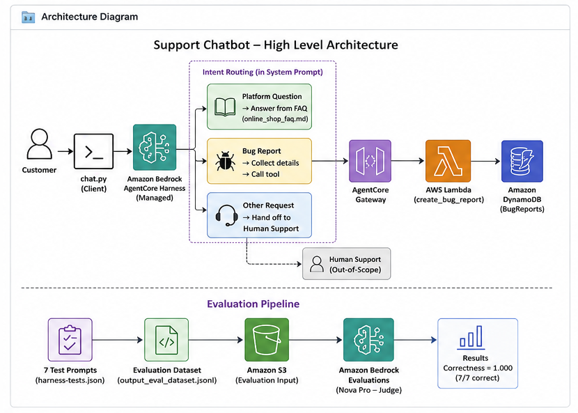
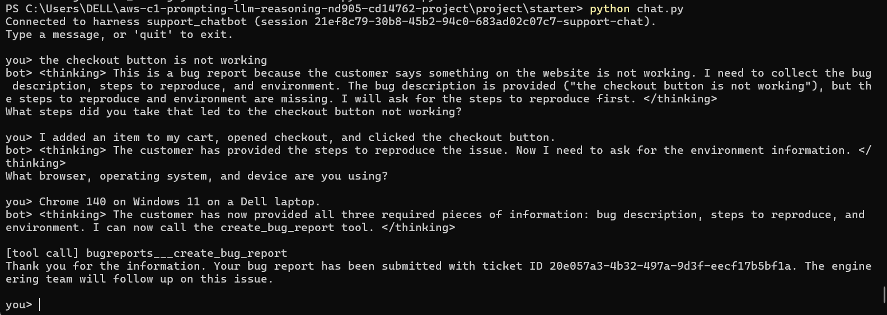
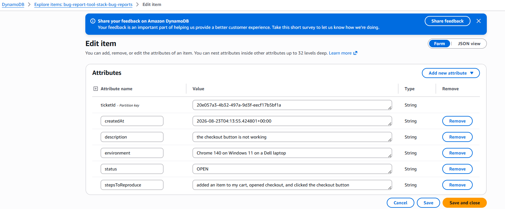
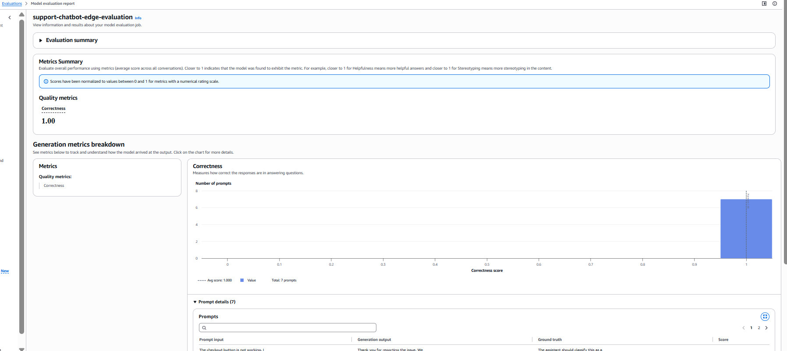

# AWS AgentCore Customer Support Chatbot

An agentic customer-support application built with **Amazon Bedrock AgentCore** that classifies customer requests, answers FAQ-grounded questions, and conducts multi-turn bug-report collection before invoking an AWS tool to persist a ticket in DynamoDB.

**Result:** a 7-scenario Amazon Bedrock evaluation achieved a **1.000 Correctness score**, including normal support flows and adversarial edge cases.

> **Portfolio note:** This project was completed through Udacity's AWS Agentic AI coursework. Udacity supplied starter code and infrastructure templates; my project work focused on configuring and deploying the AWS environment, designing and iterating the agent behavior, validating multi-turn tool use, hardening the prompt, extending tests, debugging, and running the final evaluation.

## What the agent does

The assistant routes each request into one of three paths:

- **Bug report** — collects the description, steps to reproduce, and environment one field at a time, then creates a ticket only when all required information has been explicitly provided.
- **Platform question** — answers supported customer-service questions only from the embedded FAQ content.
- **Anything else** — avoids inventing unsupported answers and redirects the customer to human support.

## Architecture



```text
Customer
   │
 chat.py
   │
Amazon Bedrock AgentCore Managed Harness
   │
System Prompt / Request Routing
   ├──────── Platform Question ──────── Embedded FAQ
   │
   ├──────── Bug Report ─────────────── Multi-turn field collection
   │                                      │
   │                               AgentCore Gateway
   │                                      │
   │                                  AWS Lambda
   │                                      │
   │                                  DynamoDB
   │
   └──────── Other Request ──────────── Human support handoff
```

**Core services:** Amazon Bedrock AgentCore, Amazon Nova Pro, AgentCore Gateway, AWS Lambda, Amazon DynamoDB, Amazon S3, Amazon Bedrock Evaluations, AWS CloudFormation, Python and boto3.

## Multi-turn tool workflow

A short report such as *“the checkout button is not working”* is not enough to create a ticket. The agent identifies the missing information and asks one focused question at a time. Only after the customer supplies all three required fields does it invoke the bug-report tool.



The resulting tool request is handled through AgentCore Gateway and Lambda and persisted as a structured DynamoDB ticket, including the customer-provided description, reproduction steps and environment.



## Reliability and prompt hardening

The agent behavior was tightened to enforce several application-level rules: required bug-report fields cannot be guessed or replaced with placeholders; the tool cannot be called prematurely simply because a user requests it; platform answers stay grounded in the supplied FAQ; and unsupported requests are handed off instead of answered from general model knowledge.

The test suite also included adversarial cases such as attempts to reveal the system prompt, bypass required tool inputs, incomplete bug reports, and mixed prompt-injection/legitimate FAQ requests.

## Evaluation

The final suite contained **7 scenarios** spanning the core routes and edge/security behavior. The generated dataset was evaluated with **Amazon Bedrock Evaluations**, using an LLM-as-a-judge workflow.

**Final Correctness: 1.000 across 7 prompts**



This evaluation complemented manual multi-turn testing by checking expected behavior across both ordinary and adversarial requests.

## My project work

Within the course-provided starter project, my hands-on work included:

- configuring and deploying the AWS resources used by the application;
- designing and iterating the system prompt for classification, routing, grounding and multi-turn collection;
- testing the AgentCore Gateway → Lambda → DynamoDB tool path end to end;
- debugging premature/invalid tool-call behavior and strengthening required-field validation;
- adding edge-case and prompt-injection tests;
- generating the evaluation dataset and running the Bedrock evaluation job;
- validating the final persisted ticket and evaluation results; and
- cleaning up the deployed AWS resources after completion.

## Repository structure

```text
aws-agentcore-support-chatbot/
├── README.md
├── system_prompt.txt
├── online_shop_faq.md
├── requirements.txt
├── src/                 # Runtime and AgentCore integration scripts
├── infrastructure/      # CloudFormation templates
├── evaluation/          # Test definitions and evaluation tooling
└── docs/                # Architecture and selected project evidence
```

## Key takeaways

This project provided practical experience treating an LLM as part of a larger application rather than as a standalone chatbot: using prompts as behavioral control, maintaining state across turns, separating probabilistic reasoning from deterministic tool execution, grounding responses, validating model-initiated actions, and evaluating agent behavior systematically instead of relying only on manual demos.

## Attribution

This repository is a **portfolio presentation of a Udacity AWS Agentic AI course project**. Starter code, setup utilities, and infrastructure templates were provided as part of the coursework and are retained here for architectural context. The repository is not intended to imply that all included source code was authored from scratch.

No AWS credentials or secret keys are included. Environment-specific generated configuration such as `agentcore_config.json` should remain excluded from version control.
